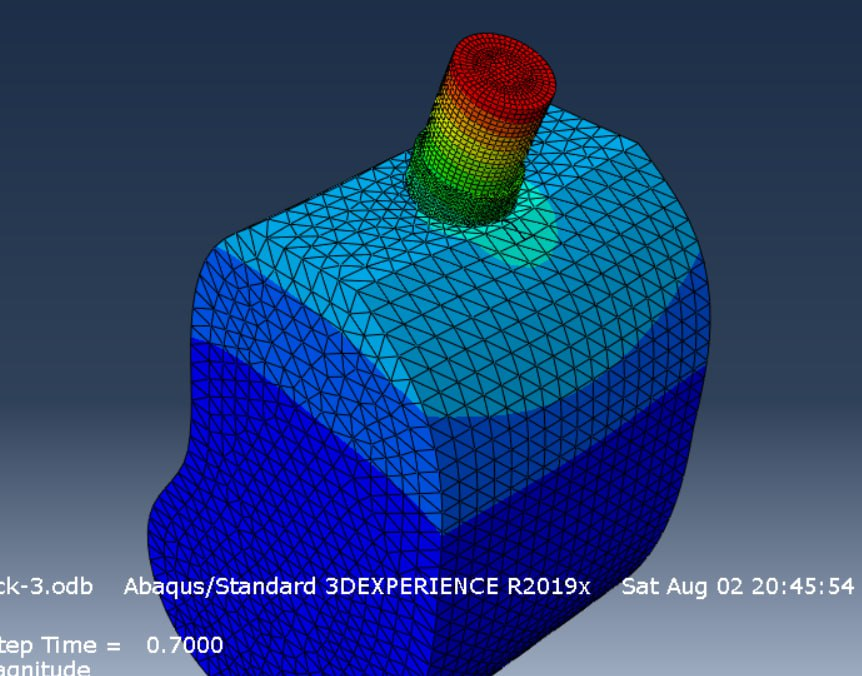
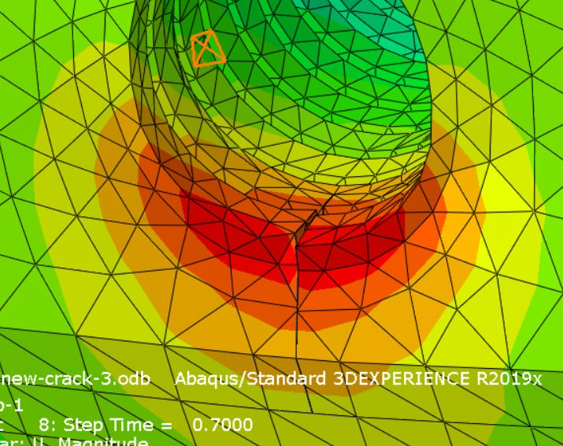
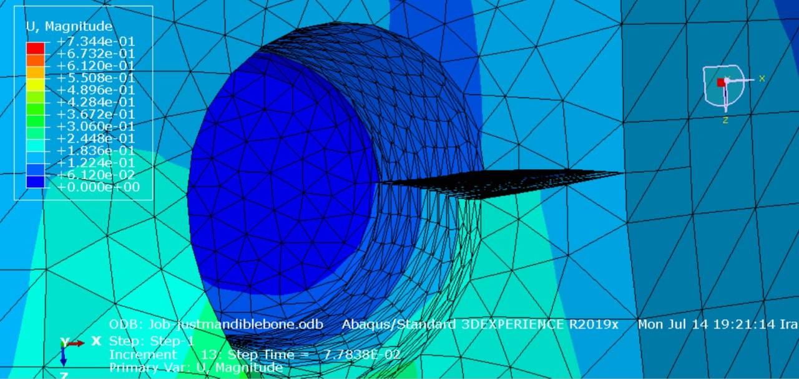
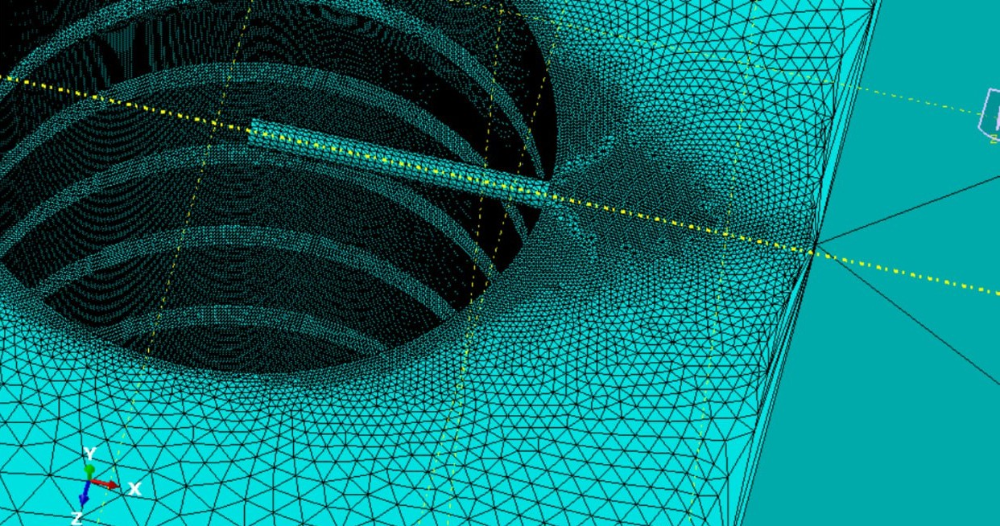
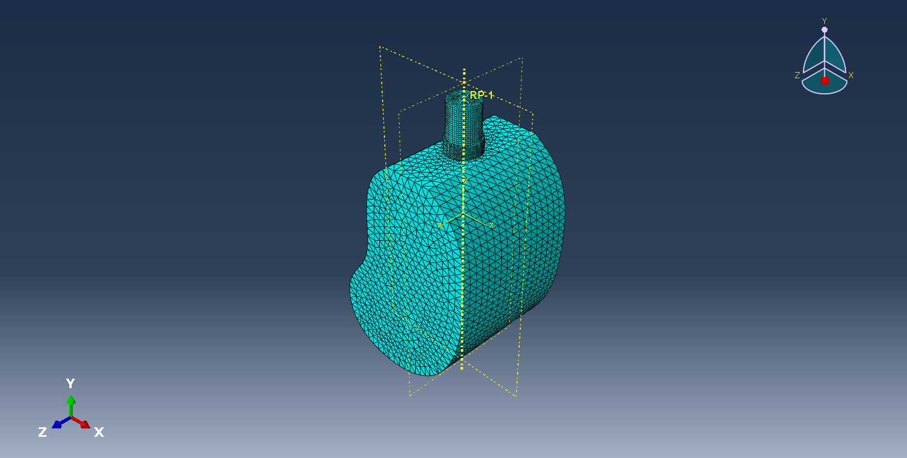
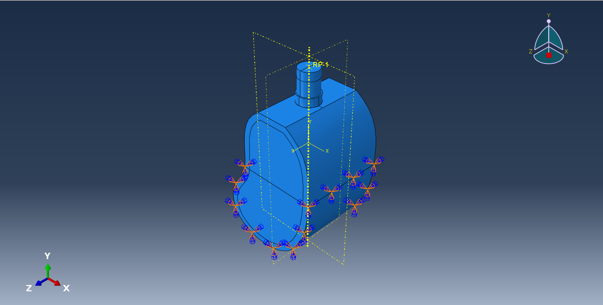

Finite Element Analysis of a Dental Implant in Abaqus

This repository contains the models, results, and analysis files for a Finite Element Method (FEM) study of a dental implant. The project includes the validation of the FEM model against existing literature and an investigation into stress concentration and crack development.

This analysis was performed using Abaqus/Standard.

Project Overview

The primary goal of this project is to simulate the biomechanical behavior of a dental implant embedded in a mandible bone segment. This involves two main stages:

Model Validation: The FEM model is validated by recreating the study presented in the paper "Selection of the implant thread pitch for optimal biomechanical properties: A three-dimensional finite element analysis" (Kong et al., 2008).

Crack Analysis: The validated model is then used to investigate stress concentrations and simulate the initiation and development of cracks at the implant-bone interface or within the implant structure.

Methodology

1. Model Geometry

The model consists of a simplified mandible bone block and a threaded dental implant. The bone is modeled with two distinct parts:

Cortical Bone: The dense outer layer.

Cancellous Bone: The softer, spongy inner bone.

2. Mesh

A 3D solid mesh was generated for all components. A finer mesh is used in the areas of high interest, particularly around the implant threads and the implant-bone interface, to ensure accurate stress results.

3. Material Properties

All materials (cortical bone, cancellous bone, and titanium implant) are assumed to be isotropic and linearly elastic, based on the properties defined in the validation paper.

4. Loads and Boundary Conditions

Boundary Conditions: The mesial, distal, and inferior faces of the bone block are constrained (encastred) to simulate the surrounding jaw structure.

Loading: Axial and/or buccolingual (lateral) loads are applied to the top of the implant abutment to simulate chewing forces.

5. Validation

The results for stress distribution (Von Mises) in the cortical bone, cancellous bone, and implant complex are compared with the published results from the reference paper to ensure the model's accuracy and behavior.

Validation Reference:

Kong, L., Zhao, Y., Hu, K., Li, D., Zhou, H., Wu, Z., & Liu, B. (2009). Selection of the implant thread pitch for optimal biomechanical properties: A three-dimensional finite element analysis. Advances in Engineering Software, 40(6), 474-478. DOI: 10.1016/j.advengsoft.2008.08.003

6. Crack Development Analysis

Using the validated base model, a crack is introduced at a high-stress location (e.g., the root of an implant thread) to analyze:

Stress intensity factors.

Crack propagation path.

Potential failure modes under cyclic loading.

Repository Contents

This repository may contain the following files:

implant_model.cae: The main Abaqus/CAE database file containing the complete model (geometry, mesh, loads, etc.).

implant_model.jnl: Abaqus journal file. This is a log of all commands and actions from an Abaqus/CAE session, recorded as Python code. It is useful for recovering a model after a crash or for learning how to script specific commands.

How to Use

View Model: Open the .cae file in Abaqus/CAE.

View Results: Open the .odb file in Abaqus/Viewer to post-process and visualize the stress, strain, and displacement contours.
